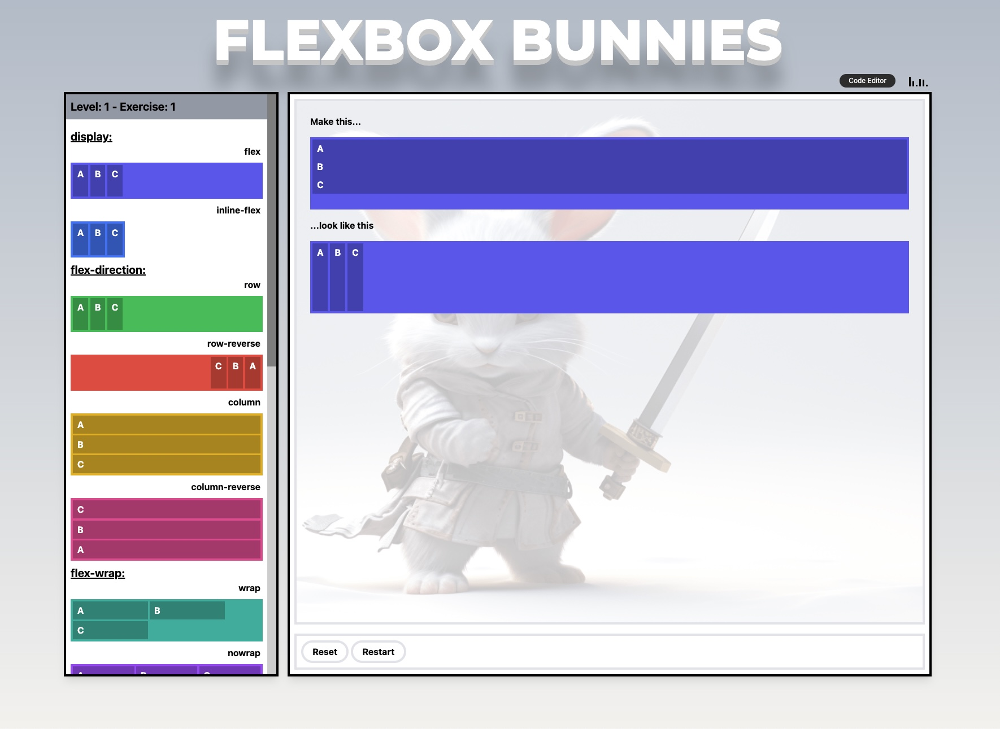

# Flexbox Bunnies (under development...)

[Demo](https://in-tech-gration.github.io/learn-flexbox/)

## Let's learn some CSS Flexbox properties

## Todo

  - Integrate: https://pjmazenot.github.io/steps.js/

  - Add all Flexbox properties, categorized under Parent and Child 

  - Add Skip to next exercise button

  - Exercises can contain custom (general) CSS, e.g. `* { box-sizing: border-box; }`

  - Warn about missing `#visual-blocks` and `#expected` classes on exercise parent elements

  - Exercises should contain extra CSS for the blocks, e.g. `aspect-ratio: 1/1`

  - Display applied styles as `<code>`

  - Make sure that rules can be disabled in the left panel by clicking them

  - Switch to a different music theme (mixkit-games-worldbeat-466.mp3)

  - Implement a loading indicator (images, sound, etc.)

  - Track Levels via global state

  - Implement NEWBIE (BABY) LEVEL 1: Disable flex container rules unless flex or inline-flex are dragged (gray-out non active flexbox rules if NO flexbox!)

  - NEWBIE (BABY) LEVEL 1: Show required colors in the target!

  - WARN NEWBIES ABOUT unnecessary rules, e.g. `flex-wrap`, when only `display: flex` is needed

  - WARN NEWBIES ABOUT `display:flex|inline-flex` required for rest of props

  - INTEGRATE: https://codepen.io/kostasx/pen/QVZrzm

  - INTEGRATE: https://github.com/philipwalton/solved-by-flexbox/tree/master

  - INTEGRATE: https://codepen.io/chriscoyier/pen/vWEMWw

  - Check if screen size is < 1280px and warn that the game is only working on large screen sizes

  - Mobile version?

  - Offline version

  - https://codepen.io/kostasx/pen/VwZVOMJ

  - Replicate: https://codepen.io/kostasx/pen/wvwQbbd (`flex-shrink`)

  - https://codepen.io/kostasx/pen/OJLXyBw (`flex-basis`)

  - Fix the hints bunny's scrollable issue

  - Keep track of CSS rules applied to the target element (visual-blocks)

  - Do not checkMatch when the rule is not dropped on a target

  - INTEGRATE ANINATIONS: https://www.freecodecamp.org/news/flexbox-the-ultimate-css-flex-cheatsheet/ and https://medium.com/free-code-camp/an-animated-guide-to-flexbox-d280cf6afc35

## Changelog

### [0.1.5] - 19-12.2023

- Added Hints

### [0.1.4] 

### [0.1.3] 

- Added audio

### [0.1.2] 

### [0.1.1] 

### [0.1.0]

Initial Commit
